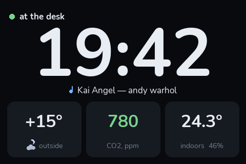
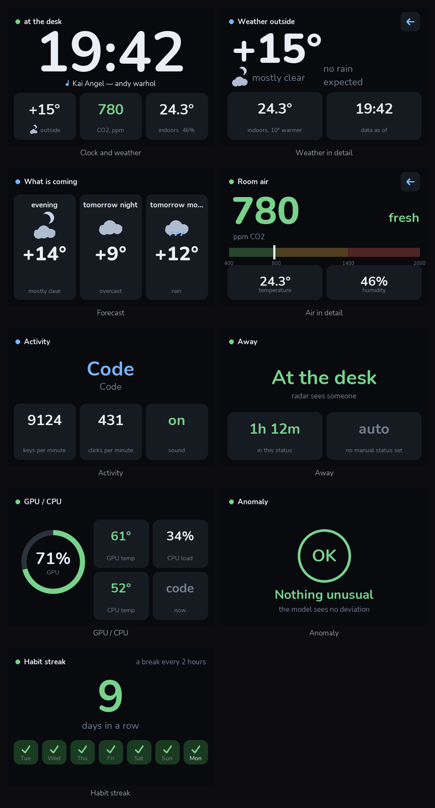
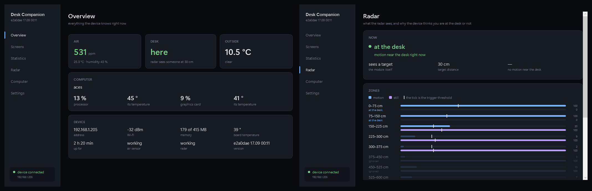

# Desk Companion

*[Русская версия](README.ru.md) — the original. This is a translation of it.*



A desk device built on a Raspberry Pi Zero 2 W. It shows the time and the
weather, watches the air in the room, knows whether you are at your desk,
and keeps track of what you do on your computer. One case, one power cable.

Everything is drawn and tested **without the hardware**: screens render in a
browser, sensors are replaced by stubs, and 486 checks run on any machine
with Python. Only debugged code goes to the board.

---

## What it does



| | |
|---|---|
| **Clock and weather** | no seconds — the screen redraws once a minute instead of sixty times. Rain forecast 90 minutes ahead, no API key, no sign-up |
| **Air** | CO2, temperature, humidity. A scale with thresholds: you can see from across the room that it is time to open a window |
| **Presence** | a 24 GHz radar sees a motionless person — not a PIR sensor that gives up the moment you sit still |
| **Computer activity** | keystrokes, clicks, the active window, CPU and GPU load and temperatures |
| **Now playing** | the track from your computer — any player, Windows collects them all into one list |
| **Habit streak** | how many days in a row you managed not to sit longer than your limit without a break |
| **Anomaly detection** | a model learns your ordinary week and flags the sessions that do not look like it |

Control is by rotary encoder, by touch, or by swipe. Which screens appear
and in what order is set with the mouse — in the desktop app or in a
browser, without touching the code.

**Language and location.** The device switches between Russian and English,
and the weather city is searched across every populated place on Earth —
not from a built-in list of major cities, which would not contain your
village anyway. Both are changed from the app, take effect immediately, and
survive a code update.

---

## What to buy

| What | For | Note |
|---|---|---|
| Raspberry Pi Zero 2 W | everything | the **2 W** specifically: you need Wi-Fi and four cores |
| 4″ ST7796S 480×320 SPI display with XPT2046 touch | the screen | resistive touch, works through gloves |
| LD2410 (or LD2410B/C) | presence | **not** an HC-SR501: that one only sees motion |
| SCD41 | CO2, temperature, humidity | a real NDIR sensor, not an "eCO2" estimate |
| KY-040 | rotary encoder with a button | |
| 2×20 header, PLD-40 | must be soldered onto the Pi Zero | the Zero ships without one |
| Female-to-female jumpers, microSD 8 GB+ | wiring | class A1 is not required, see below |
| Soldering iron, flux, solder | the header and the splitters | |

About the card: we measured ours — 16 GB, no A1 rating — at 285 random
writes per second, against the 500 that A1 requires. The device performs
**three**. So the speed class does not matter; what matters is that the card
is genuine. Among cheap cards, counterfeits are more common than slow ones.

---

## Building it

The short version is below. The long one — soldering the header, what to do
if you bridged two pins, and a failure table for every module — is in
[СБОРКА.md](СБОРКА.md) (Russian).

### 1. Flash the card

Raspberry Pi OS Lite, **64-bit**. In Imager, open "Edit Settings" and set
the hostname, user, SSH, and a **2.4 GHz network** — the Zero 2 W cannot see
5 GHz at all.

### 2. Deliver the code and set up the system

```bash
bash deploy.sh alex@192.168.1.42
```

The address is remembered; after that `bash deploy.sh` is enough. From
Windows, `hostname.local` resolves only about half the time, so it is
simpler to use the numbers.

Then on the board itself:

```bash
sudo bash setup-step1.sh && sudo reboot
sudo bash check-step1.sh && sudo bash setup-step2.sh
```

The first enables I2C, SPI and UART and disables Bluetooth — otherwise
Bluetooth takes the real UART and leaves the pins with the mini-UART, whose
clock drifts with the CPU, and the radar cannot hold a link. The line to
look for in the check is `/dev/serial0 -> ttyAMA0`.

The second installs libraries **through apt, not pip**: pip outside a
virtualenv is blocked (PEP 668), and building numpy on a Zero 2 W takes
hours.

> **The MQTT broker comes up without a password**, and the dashboard on port
> 843 without authentication. That is deliberate: this device is meant to
> sit on a home network behind a router, and a password on a broker only you
> can reach buys nothing. But it is your decision, not ours — if the board
> will live anywhere reachable from outside, set up `mosquitto` credentials
> and do not forward those ports.

### 3. Solder and connect one module at a time

Diagrams: [the routing sheet](docs/маршрутный-лист.png) — what goes where,
in pin order; [by lines](docs/подключение-линиями.png) — how each wire runs;
[the pinout](docs/распиновка.png) — the whole header.

Check after every module. This is the one rule that matters: connect
everything at once and you cannot tell a dead sensor from a miswired
neighbour.

```bash
python3 tools/bringup.py kernel
python3 tools/bringup.py display
```

Then `touch`, `encoder`, `radar`, `air`, in whatever order you solder them.
On failure each step prints which wire to look at.

### 4. Calibration

```bash
python3 tools/touch_calibrate.py
```

Draws a cross and waits for a press — for as long as you like, with no
countdown. It sets both the coordinates and the press force, and writes the
result itself.

Or without SSH at all: **Settings → Touch calibration** in the desktop
app. The crosses appear on the device screen, you press four corners, and
the result applies at once — no service restart. The orientation of the
panel is worked out from the presses themselves, so a mirrored or rotated
panel calibrates just as well.

Press force can also be adjusted without calibrating, with the "touch
sensitivity" slider in the app or in the browser. It takes effect at once;
no reboot. Whichever you did last wins: move the slider and the slider
rules, calibrate and the slider is forgotten.

```bash
python3 tools/radar_calibrate.py --auto
```

The radar does not need calibration on the spot — it needs a day of
observation. The device counts how often each zone reported each energy
level, and over a day a room is both empty and occupied. The command derives
the thresholds from what accumulated. You do not need to leave the room or
stop the service. How many hours have accumulated so far is shown at the
bottom of the Radar page in the app.

### 5. Autostart

```bash
sudo bash systemd/install.sh
```

Brings up the display service and the dashboard. Verify by rebooting:
everything should come back on its own, and the clock appears about
seventeen seconds after power-on.

---

## The desktop app



`pc/DeskCompanion` is one .NET 8 program: the window and the collection of
data from the computer. Its pages are the overview, the screen list,
statistics, the radar, the computer and settings. It lives in the tray,
waits for the device and picks it up the moment it appears on the network —
and if the device changes its address, the app finds it on the network by
itself. The interface is in English or Russian; the choice in the settings
switches the device screen too. Adding a language is one file in
`pc/DeskCompanion/Strings`.

**Collection** — keystrokes and clicks, CPU and GPU load and temperatures,
the active window and the current track — runs in the background and goes to
the device over MQTT. Only the number of keystrokes is counted: which keys
were pressed, the app never sees. One checkbox on the Computer page turns
it off, and the same page shows what is collected and with which rights.

**The Radar page** explains why the device thinks you are at the desk or
not: "motion near the desk 4 s ago", or "no motion near the desk for 3 min,
while the radar still sees a target in the 150–225 cm zone". Below are the
nine zones, each with a motion bar, a still-presence bar and the trigger
threshold — a zone that crossed it lights up.

It deliberately has no counting logic of its own: the metrics and the screen
list live on the device, which also keeps the database. A second copy of the
arithmetic on the PC would mean two sources of truth, diverging exactly when
someone looks at them.

Once a day the app pulls the measurement database down to itself. This is
not a luxury: the history lives on a memory card in a single copy, and cards
are consumables that die without warning.

The prebuilt program is on the [releases page](../../releases): one file,
download and run. You do not need to install .NET — the runtime is inside.

**Autostart** is the "Start with Windows" checkbox in Settings. It creates a
Scheduled Task with the highest privileges: without administrator rights
LibreHardwareMonitor cannot read temperatures, and ordinary autostart would
mean a UAC prompt at every single login. This way Windows asks once — when
you tick the box — and from then on the app starts with those rights
silently.

To build it yourself (needs the
[.NET 8 SDK](https://dotnet.microsoft.com/download/dotnet/8.0)):

```
powershell -ExecutionPolicy Bypass -File pc\build.ps1
```

It lands in a folder named `Программа` next to the project, along with a
desktop shortcut. The separate folder is not decoration: dotnet's own output
path looks like `bin\Release\net8.0-windows\win-x64\publish\`, which is
impossible to remember and impossible to find.

What exactly is collected, where the files live and how the rights work —
[ПРИЛОЖЕНИЕ.md](ПРИЛОЖЕНИЕ.md) (Russian).

**Before version 0.3.0** there were two programs on the PC — the window and
an agent. The new app removes the agent by itself: its task, its process and
its sensor driver. A leftover `DeskAgent.exe` can be deleted.

---

## When it does not work

| What you see | What to look at |
|---|---|
| Screen dark, but the device answers over the network | the backlight on GPIO18. A one-shot script releases the pin after showing a frame and the screen goes dark — that is normal; test with something long-running |
| Horizontal stripes across the picture | SPI clock. Every stub on the bus degrades the edges; with the touch panel and our hand-made splitters we had to come down from 32 MHz to 16 |
| The radar is silent | `python3 tools/radar_wake.py`. The module can get stuck in configuration mode, and **rebooting the board does not fix it**: 5 V never drops during a reboot |
| The air sensor answers but returns zeros | pull the power physically, from the wall. Same reason: a reboot does not de-energise the modules |
| Touch needs a hard press | the "touch sensitivity" slider in the app or the browser, to the right. Underneath it is `max_resistance` in `[touch]`: resistance is inverse to force, so a low threshold is what means "press harder" |
| The device reports presence in an empty room | open the Radar page in the app: it says why the device decided so and shows which zone crossed its threshold. If a far zone is holding presence, something moves at that distance: a curtain, a fan, a person behind a door — a 24 GHz radar sees through thin walls. Presence is held only by motion near the desk, so such a thing cannot keep "at the desk" on for more than three minutes. If a zone near the desk lights up, it is the radar thresholds — see step 4 |
| The app says "no connection" | Settings → "Find on the network": the app walks its subnet and remembers the device's address. "The device answers, but its service is not running" means the service on the device is restarting or has crashed — see `journalctl -u desk-companion -b` |
| The service started but something is missing | `journalctl -u desk-companion -b` prints which module failed to come up and why |

---

## Developing without the hardware

```bash
cd pi && py preview_server.py          # localhost:842 — screens and an input emulator
py tools/seed.py --days 21 && py dashboard_server.py   # localhost:843 — the dashboard
py -m app.main --fake                  # the whole service, frames into preview/live.png
```

Checks worth running after any interface change:

| Command | What it catches |
|---|---|
| `py tools/check_imports.py` | an import that resolves to a name which does not exist. Sounds impossible — but this is exactly why the radar never once came up through the service, and neither tests nor linters see it |
| `py tools/check_config.py` | a setting that leads nowhere: the key exists but no code reads it, or the reverse. Plus a screen that scrolls on the device but is missing from the settings list |
| `py tools/check_language.py` | text that stayed Russian with English selected. Found by running, not by reading: we render every screen and see what slipped past the dictionary |
| `py tools/check_layout.py` | text past the edge of the screen and captions colliding, across four states of the data |
| `py tools/check_layout.py --en` | the same in English: the words are a different length, and a caption that fitted in Russian can run off the edge |
| `py tools/walk_menu.py` | walks every state of the menu: dead ends, and places more than three actions away from the carousel |
| `py ../pc/check_strings.py` | a string missing from one of the desktop app's languages, or a translation that lost a `{0}` — which does not crash, it just prints the sentence without the number |
| `py tools/latency.py` | what the delay from "the sensor saw it" to "it is on screen" is made of |
| six `test_*.py` files | 486 checks, all without hardware |

---

## How it is put together

```
pi/app/
  main.py        the main loop: polls sources, draws, writes to the database
  director.py    what is on screen: carousel, idle, or an overlay
  hardware.py    the only place where spidev, gpiozero and pyserial live
  state.py       the shared state — sources write it, screens read it
  screens/       screens, idle modes, settings, shared widgets
  sources/       sensors, weather, MQTT, device health; each with its own period
  drivers/       protocols: LD2410, SCD41, XPT2046, the encoder
  display/       two backends — SPI and PNG — behind one interface

pc/DeskCompanion/
  Collection/    collection from the PC: windows, input, audio, track, sensors, MQTT
  Services/      talking to the device, network search, autostart, settings, languages
  Strings/       the window's text, one file per language
```

Two principles, from which the rest follows.

**The preview runs the real rendering code.** What goes to the browser is
the same 480×320 PNG that goes to the screen. If the page drew the interface
by its own means, there would be two implementations of one layout, and they
would drift apart within a fortnight. For the same reason the font is in the
repository rather than taken from the system: Segoe UI and DejaVu have
different metrics, and the preview would lie about whether text fits.

**Transport is separated from protocol.** The drivers know bytes but know
nothing about spidev. That is why radar frame parsing, the air sensor's
checksums and the encoder's debouncing were all tested before anything was
soldered.

How to add your own screen — [ВКЛАД.md](ВКЛАД.md). The case, ventilation,
and why the radar must not sit behind the screen —
[КОРПУС.md](КОРПУС.md). Current state and the build log —
[TODO.md](TODO.md). These are in Russian; a translation is
[welcome](CONTRIBUTING.md).

---

## What is next

- **A 3D-printable case.** The layout, the clearances and the ventilation
  are already worked out in [КОРПУС.md](КОРПУС.md) — including why the radar
  must not sit behind the screen and where the air sensor has to face. The
  printable files will come in a separate update
- **Anomaly detection** — the model exists; it needs a week or two of data
  before it has anything to compare against

---

## Contributing

**Pull requests are welcome** — anything: a fix, a new screen, support for
another sensor, a corrected diagram, a translation. You do not have to fix
it yourself; describing a bug in the code or in the instructions as an Issue
is help too.

What to run before opening a pull request, and what we ask of a change:
[CONTRIBUTING.md](CONTRIBUTING.md).

Everything is verifiable without the hardware — all you need is Python.

---

## Licence

[MIT](LICENSE) — take it, change it, build one for yourself, put it in your
own projects, including paid ones. The one condition is not to pass it off
as your own: keep the attribution line. No warranty of any kind: if you
solder it to the wrong pin, that is your soldering iron.

Third party: the Nunito font — SIL Open Font License, included in the
repository. Weather — [Open-Meteo](https://open-meteo.com), no key, no
sign-up. `.NET`, `MQTTnet`, `NAudio` — MIT; `LibreHardwareMonitorLib` —
MPL 2.0.
