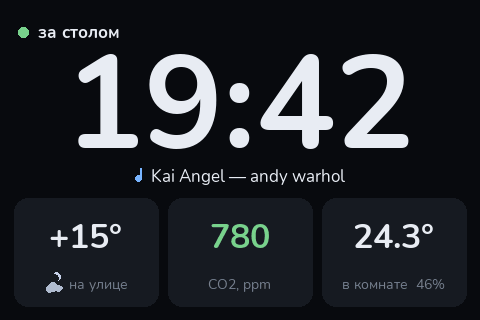
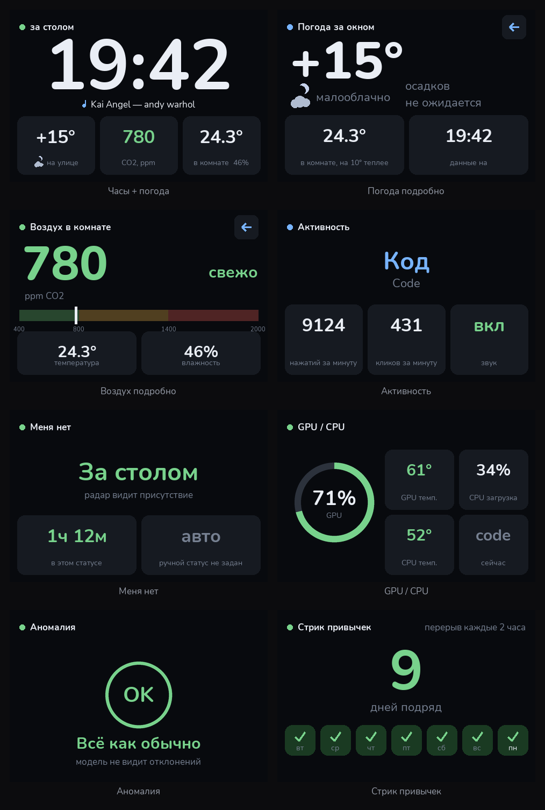
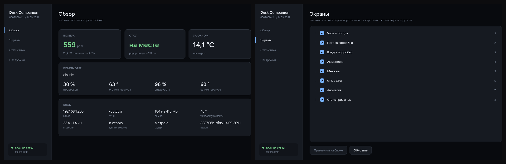

# Desk Companion



Настольный блок на Raspberry Pi Zero 2 W. Показывает время и погоду, следит
за воздухом в комнате, знает, сидите вы за столом или нет, и ведёт
статистику работы за компьютером. Один корпус, один провод питания.

Всё рисуется и проверяется **без железа**: экраны собираются в браузере,
датчики подменяются заглушками, 378 проверок гоняются на любой машине с
Python. На плату уезжает уже отлаженное.

---

## Что он умеет



| | |
|---|---|
| **Часы и погода** | без секунд — экран перерисовывается раз в минуту, а не 60 раз. Прогноз дождя на полтора часа вперёд, без ключей и регистраций |
| **Воздух** | CO2, температура, влажность. Шкала с порогами: когда пора проветрить, видно с другого конца комнаты |
| **Присутствие** | радар 24 ГГц видит и неподвижного человека — не датчик движения, который гаснет, когда сидишь смирно |
| **Активность за ПК** | нажатия, клики, активное окно, загрузка и температуры процессора и видеокарты |
| **Что играет** | трек с компьютера — любой плеер, система сама собирает их в общий список |
| **Стрик привычек** | сколько дней подряд удавалось не сидеть без перерыва дольше заданного |
| **Поиск странного** | модель учится на вашей обычной неделе и отмечает непохожие сессии |

Управление — энкодером, пальцем по экрану или свайпом. Состав экранов и их
порядок правятся мышкой в приложении или в браузере, без правки кода.

---

## Что нужно купить

| Что | Зачем | Примечание |
|---|---|---|
| Raspberry Pi Zero 2 W | всё целиком | именно 2 W: нужен Wi-Fi и четыре ядра |
| Экран 4″ ST7796S 480×320 SPI с тачем XPT2046 | дисплей | тач резистивный, работает и в перчатках |
| LD2410 (или LD2410B/C) | присутствие | **не** HC-SR501: тот видит только движение |
| SCD41 | CO2, температура, влажность | настоящий NDIR, а не «эквивалент CO2» |
| KY-040 | энкодер с кнопкой | |
| Гребёнка 2×20 PLD-40 | к Pi Zero её надо припаять | на Zero гребёнки нет |
| Провода «мама-мама», microSD 8 ГБ+ | обвязка | класс A1 не обязателен, см. ниже |
| Паяльник, флюс, припой | гребёнка и разветвители | |

Про карту: измерили свою на 16 ГБ без класса A1 — 285 операций записи в
секунду при норме A1 в 500. Блок при этом пишет **три**. То есть класс не
важен, важно чтобы карта была настоящая: подделок среди дешёвых больше,
чем медленных.

---

## Как собрать

Коротко — ниже. Подробно, с пайкой гребёнки, разбором «что если замкнул» и
таблицей отказов по каждому узлу — [СБОРКА.md](СБОРКА.md).

### 1. Прошить карту

Raspberry Pi OS Lite, **64-битная**. В Imager открыть «Edit Settings» и
задать имя, пользователя, SSH и **сеть 2,4 ГГц** — пятигигагерцевую Zero 2 W
не видит.

### 2. Доставить код и настроить систему

```bash
bash deploy.sh alex@192.168.1.42
```

Адрес запоминается, дальше достаточно `bash deploy.sh`. Из Windows имя
`имя.local` резолвится через раз, поэтому проще сразу цифрами.

Дальше на самой плате:

```bash
sudo bash setup-step1.sh && sudo reboot
sudo bash check-step1.sh && sudo bash setup-step2.sh
```

Первый включает I2C, SPI и UART и отключает Bluetooth — иначе настоящий
UART достаётся ему, а на ножках остаётся mini-UART с плавающей скоростью, и
радар связи не держит. Ключевая строка проверки — `/dev/serial0 -> ttyAMA0`.

Второй ставит библиотеки **через apt, а не pip**: pip вне окружения
заблокирован (PEP 668), да и собирать numpy на Zero 2 W — часы.

### 3. Паять и подключать по одному узлу

Схемы: [маршрутный лист](docs/маршрутный-лист.png) — что куда втыкать по
порядку ножек, [линиями](docs/подключение-линиями.png) — как провод идёт,
[распиновка](docs/распиновка.png) — вся гребёнка целиком.

После каждого узла — проверка. Это главное правило: подключив всё разом,
отказ одного датчика не отличить от ошибки в проводке другого.

```bash
python3 tools/bringup.py kernel
python3 tools/bringup.py display
```

Дальше `touch`, `encoder`, `radar`, `air` — в том порядке, в каком паяете.
Каждый шаг при отказе печатает, какой провод смотреть.

### 4. Калибровка

```bash
python3 tools/touch_calibrate.py
```

Рисует крестик и ждёт нажатия — сколько угодно долго, без отсчётов.
Настраивает и координаты, и силу нажатия, и пишет результат в конфиг сам.

Силу нажатия потом можно крутить и без калибровки — ползунком
«чувствительность экрана» в приложении или в браузере. Он действует сразу,
перезагружать блок не нужно. Побеждает сделанное последним: подвинул
ползунок — работает ползунок, откалибровал — ползунок забыт.

```bash
python3 tools/radar_calibrate.py --auto
```

Радару нужна не калибровка на месте, а сутки наблюдений: блок сам считает,
сколько раз каждая зона показывала какой уровень энергии, и за день комната
бывает и пустой, и занятой. Команда достаёт пороги из накопленного — ни
выходить из комнаты, ни останавливать сервис не нужно.

### 5. Автозапуск

```bash
sudo bash systemd/install.sh
```

Поднимает сервис экрана и дашборд. Проверьте перезагрузкой: всё должно
подняться само, часы появляются секунд через семнадцать после включения.

---

## Приложение для компьютера



`pc/DeskCompanion` — окно на .NET 8: обзор, состав экранов, статистика,
настройки. Живёт в трее, ждёт блок и подхватывает его, как только тот
появится в сети.

Своей логики подсчёта в нём нет намеренно: и метрики, и список экранов
живут на блоке, он же ведёт базу. Вторая копия подсчётов на стороне ПК
означала бы два источника правды, расходящихся ровно тогда, когда на них
смотрят.

Раз в сутки приложение забирает базу измерений себе. Это не роскошь:
история живёт на карте памяти в единственном экземпляре, а карта —
расходник, и умирают они без предупреждения.

`agent/` — второй компонент, он снимает с компьютера нажатия, загрузку,
температуры, активное окно и текущий трек и отдаёт их блоку по MQTT.

Готовые программы — на [странице релизов](../../releases): два файла,
качать и запускать. Ставить .NET не нужно, рантайм внутри.

Собрать самому (нужен [.NET 8 SDK](https://dotnet.microsoft.com/download/dotnet/8.0)):

```
powershell -ExecutionPolicy Bypass -File pc\build.ps1
```

Обе программы лягут в папку `Программа` рядом с проектом, и туда же встанет
ярлык на рабочем столе. Отдельная папка — не украшение: своё место сборки
dotnet кладёт по адресу вида `bin\Release\net8.0-windows\win-x64\publish\`,
который невозможно ни запомнить, ни найти.

Автозапуск обоих — один скрипт, от имени администратора:

```
powershell -ExecutionPolicy Bypass -File pc\autostart.ps1
```

Механики разные, и не от лени. Приложение — обычная пользовательская
программа, ему хватает ветки автозагрузки: она правится без повышения прав
и видна в диспетчере задач, то есть отключить её можно и без нас. Агенту же
нужны права администратора, иначе LibreHardwareMonitor не читает
температуры, — и через ту же ветку это означало бы запрос UAC при каждом
входе в систему. Поэтому агент идёт задачей планировщика с высокими
правами: она стартует молча. Снять всё обратно — тот же скрипт с `-Remove`.

---

## Если не работает

| Что видно | Что смотреть |
|---|---|
| Экран тёмный, но блок отвечает по сети | подсветка на GPIO18. Разовый скрипт, показав кадр, освобождает ножку и гасит экран — это норма, проверять надо тем, что живёт |
| По картинке горизонтальные полосы | скорость SPI. Каждое ответвление на шине заваливает фронты; у нас с тачем и разветвителями пришлось опуститься с 32 МГц до 16 |
| Радар молчит | `python3 tools/radar_wake.py`. Модуль умеет застревать в режиме настройки, и **перезагрузка платы его не лечит**: пять вольт при ней не пропадают |
| Датчик воздуха отвечает, но отдаёт нули | снять питание с платы физически, из розетки. По той же причине: reboot модули не обесточивает |
| Тач требует сильного нажатия | ползунок «чувствительность экрана» в приложении или в браузере, вправо. Под ним `max_resistance` в `[touch]`: сопротивление обратно силе, поэтому низкий порог и означает «дави сильнее» |
| Часы показывают присутствие в пустой комнате | радар не откалиброван, см. шаг 4 |
| Сервис запустился, но чего-то не хватает | `journalctl -u desk-companion -b` — он печатает, какой узел не поднялся и почему |

---

## Разработка без железа

```bash
cd pi && py preview_server.py          # localhost:842 — экраны и эмулятор ввода
py tools/seed.py --days 21 && py dashboard_server.py   # localhost:843 — дашборд
py -m app.main --fake                  # сервис целиком, кадры в preview/live.png
```

Проверки, которые стоит гонять после правок интерфейса:

| Команда | Что ловит |
|---|---|
| `py tools/check_imports.py` | импорт, ведущий к несуществующему имени. Звучит невозможно — но именно из-за такого радар не поднимался ни разу, а ни тесты, ни линтеры этого не видят |
| `py tools/check_config.py` | настройку, которая никуда не ведёт: ключ есть, а код его не читает — или наоборот. Плюс экран, который листается на устройстве, но не показывается в списке настроек |
| `py tools/check_layout.py` | текст за краем экрана и наезды подписей, на четырёх состояниях данных |
| `py tools/walk_menu.py` | обход всех состояний меню: ловушки и места, откуда до карусели дальше трёх действий |
| `py tools/latency.py` | из чего складывается задержка «датчик увидел → на экране видно» |
| шесть файлов `test_*.py` | 378 проверок, все без железа |

---

## Как устроено

```
pi/app/
  main.py        главный цикл: опрашивает источники, рисует, пишет в базу
  director.py    что на экране: карусель, покой или подробности
  hardware.py    единственное место, где живут spidev, gpiozero и pyserial
  state.py       общая структура состояния — источники пишут, экраны читают
  screens/       экраны, покой, настройки, общие виджеты
  sources/       датчики, погода, MQTT, здоровье блока; у каждого свой период
  drivers/       протоколы: LD2410, SCD41, XPT2046, энкодер
  display/       два бэкенда — SPI и PNG — за одним интерфейсом
```

Два принципа, из которых следует остальное.

**Превью гоняет настоящий код отрисовки.** В браузер уходит тот же PNG
480×320, что пойдёт на экран. Рисуй страница интерфейс своими средствами —
получились бы две реализации одного макета, и они разъехались бы на второй
неделе. По той же причине шрифт лежит в репозитории, а не берётся
системный: у Segoe UI и DejaVu разные метрики, и превью врало бы про то,
влезает ли текст.

**Транспорт отделён от протокола.** Драйверы знают байты, но не знают про
spidev. Поэтому разбор кадров радара, контрольные суммы датчика воздуха и
антидребезг энкодера проверены тестами до того, как что-либо припаяно.

Как добавить свой экран — [ВКЛАД.md](ВКЛАД.md). Про корпус, вентиляцию и
то, почему радар нельзя ставить за экраном — [КОРПУС.md](КОРПУС.md).
Состояние работ и журнал сборки — [TODO.md](TODO.md).

---

## Что дальше

- **Модель корпуса под печать.** Компоновка, зазоры и вентиляция уже
  разобраны в [КОРПУС.md](КОРПУС.md) — там же сказано, почему радар нельзя
  ставить за экраном и куда обязан смотреть датчик воздуха. Файлы для
  печати появятся отдельным обновлением
- **Поиск странного** — модель есть, ей нужны одна-две недели данных, чтобы
  ей было с чем сравнивать

---

## Лицензия

[MIT](LICENSE) — берите, правьте, собирайте себе, ставьте в свои проекты, в
том числе в платные. Единственное условие — не выдавать за своё: оставить
строчку об авторстве. Гарантий никаких: если припаяете не туда, это ваш
паяльник.

Стороннее: шрифт Nunito — SIL Open Font License, лежит в репозитории.
Погода — [Open-Meteo](https://open-meteo.com), без ключа и регистрации.
`.NET`, `MQTTnet`, `NAudio` — MIT; `LibreHardwareMonitorLib` — MPL 2.0.
